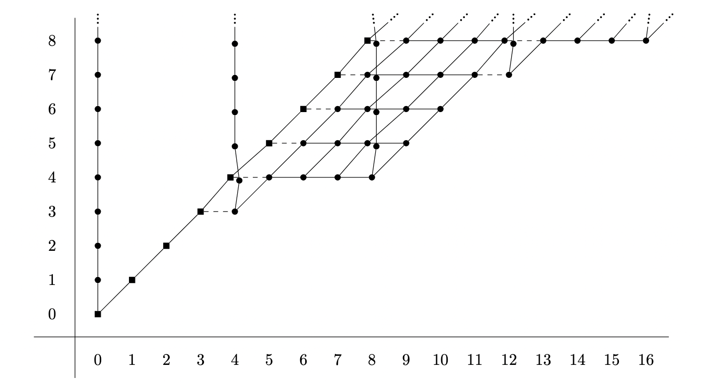
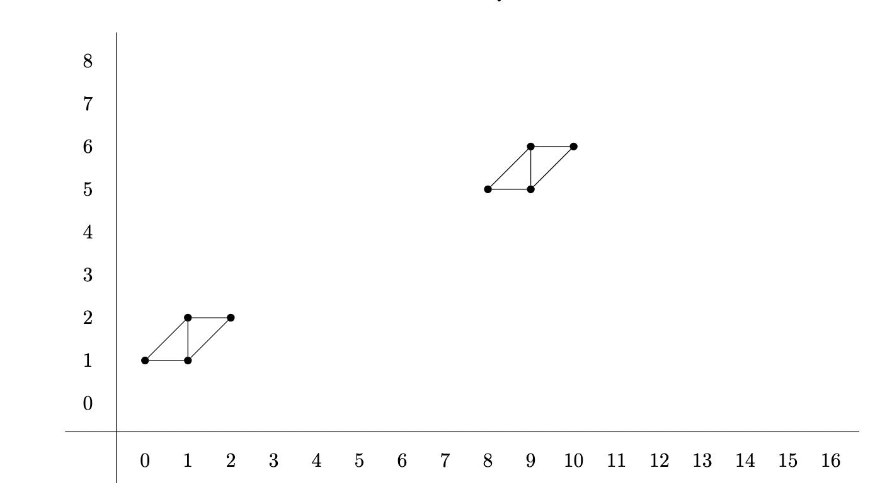
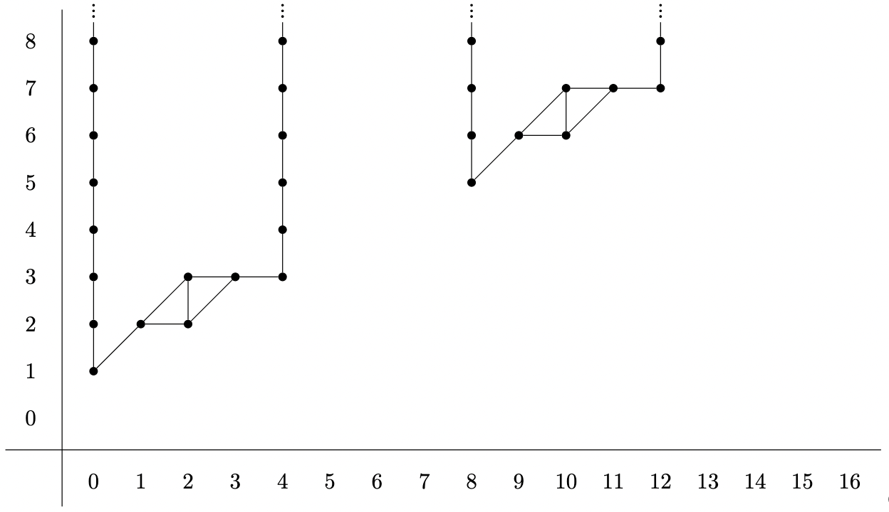
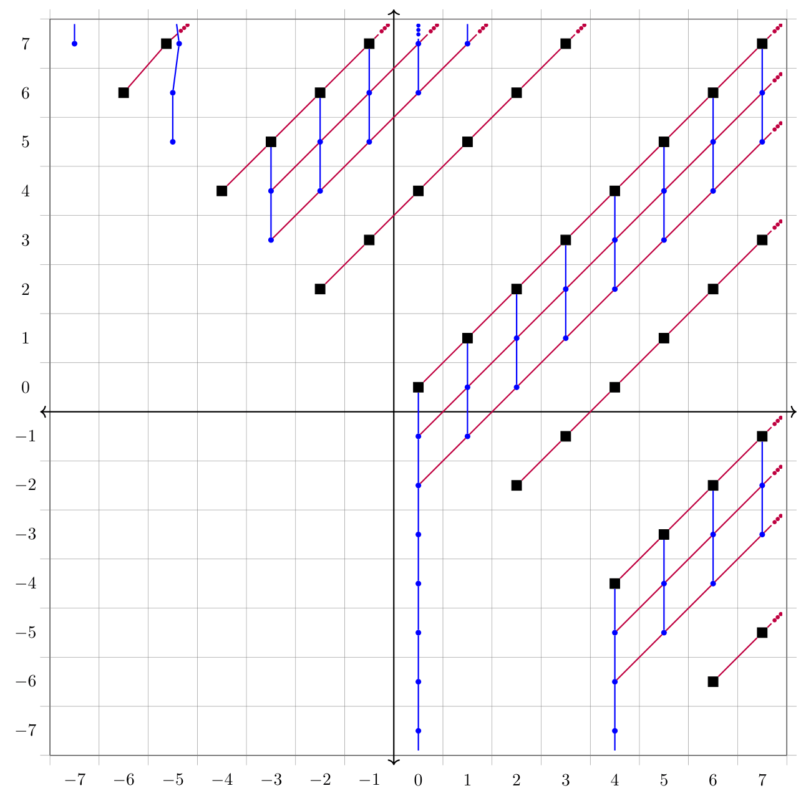
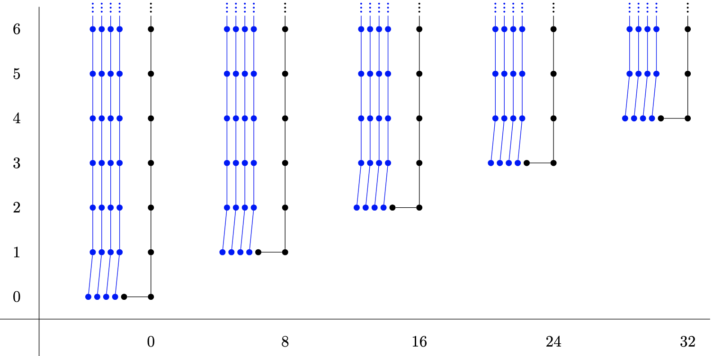
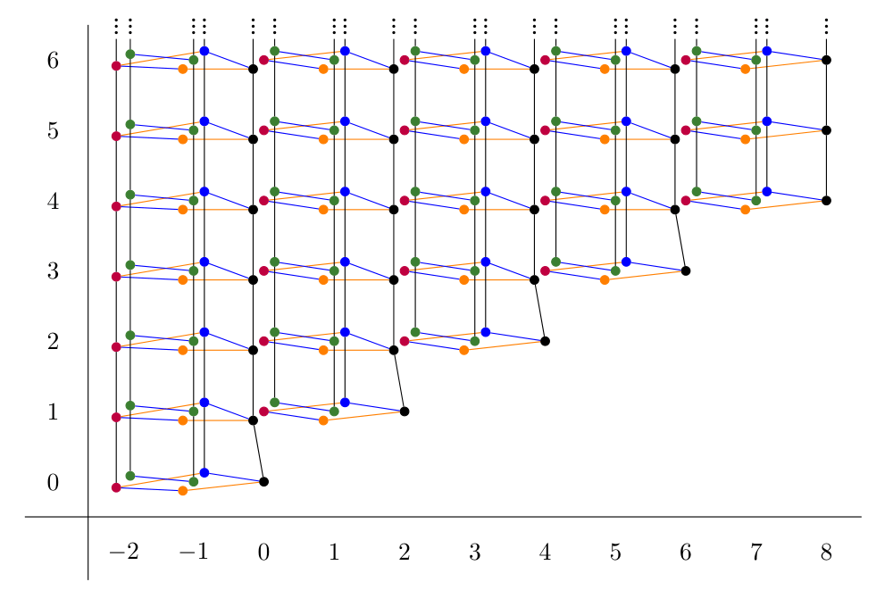
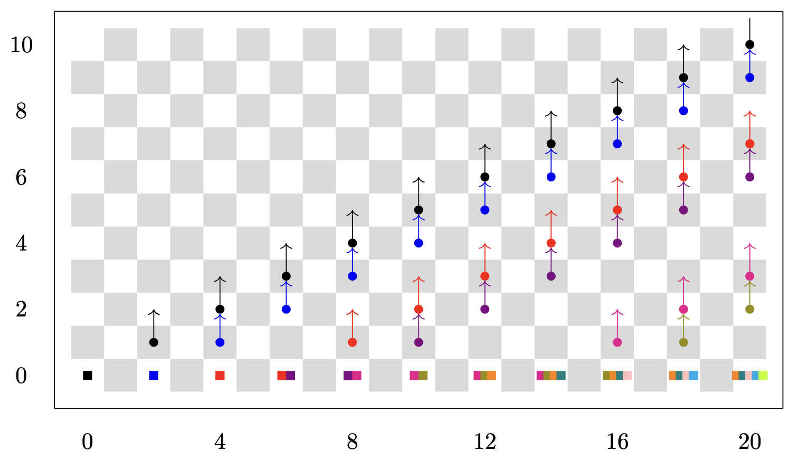
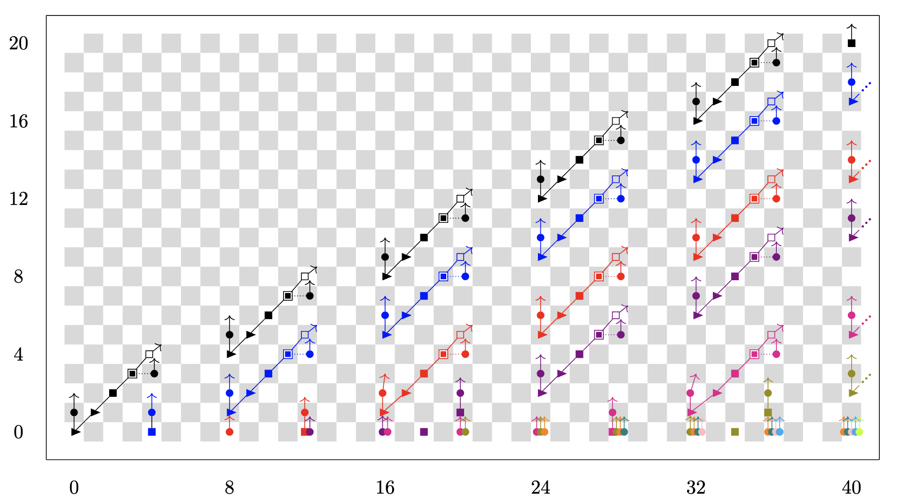
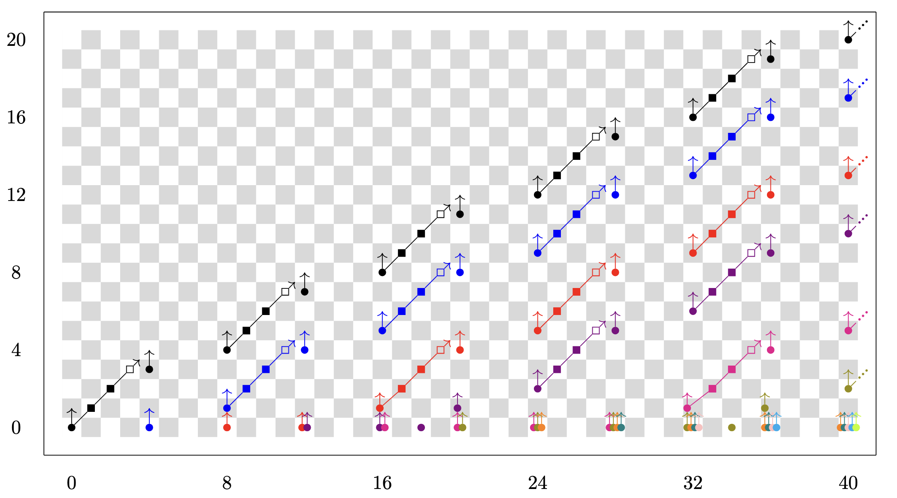

I have made many charts, and other figures, in my research. Here are a few that I am most proud of.

The $\mathbb{R}$-motivic cohomology of $A(1)$
=====

|  |
| :--: |
| $\text{Ext}_{A(1)^\vee}^{***}(\mathbb{M}_2^\mathbb{R}, \mathbb{M}_2^\mathbb{R})$ in coweight $cw \equiv 0 \, (4)$ |

|  |
| :--: |
| $\text{Ext}_{A(1)^\vee}^{***}(\mathbb{M}_2^\mathbb{R}, \mathbb{M}_2^\mathbb{R})$ in coweight $cw \equiv 1 \, (4)$ |

|  |
| :--: |
| $\text{Ext}_{A(1)^\vee}^{***}(\mathbb{M}_2^\mathbb{R}, \mathbb{M}_2^\mathbb{R})$ in coweight $cw \equiv 2 \, (4)$ |

The $RO(C_2)$-graded homotopy of $\text{k}\mathbb{R}$
=====

Motivic spectral sequences for algebraic K-theory
=====

|  |
| :--: |
| The $\text{E}_2$-term of the $\text{H}\mathbb{F}_2$-based motivic Adams spectral sequence computing $\pi_{**}^{\mathbb{F}_5}(\text{kgl})$ |

|  |
| :--: |
| The $\text{E}_2$-term of the $\text{H}\mathbb{F}_2$-based motivic Adams spectral sequence computing $\pi_{**}^{\mathbb{Q}_3}(\text{kgl})$ |

Cooperations
=====

|  |
| :--: |
| The 2-primary ring of connective algebraic K-theory cooperations over $\mathbb{C}$ |

|  |
| :--: |
| The 2-primary ring of connective hermitian K-theory cooperations over $\mathbb{F}_3$ |

|  |
| :--: |
| The 2-primary ring of connective hermitian K-theory cooperations over $\mathbb{F}_5$ |

